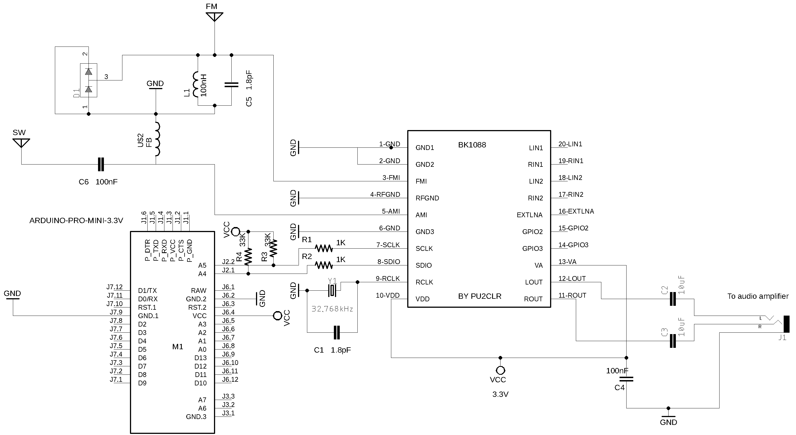

# PU2CLR BK108X Arduino Library

The BK1088E is a single-chip solution for receiving AM, FM, and shortwave radio. 
Using inexpensive components (Arduino Pro Mini, some push buttons buttons, and a standard OLED or TFT display), the  hobbyists can build serviceable little receiver based on BK1088E with a impressive performance.  

This project is about an Arduino Library to control the BK1086 and BK1088 devices. It was based on "BK1086/88E BROADCAST AM/FM/SW/LW RADIO RECEIVER; Rev.1.3" documentation from BEKEN Corporation.

This library can be freely distributed using the MIT Free Software model. 

[Copyright (c) 2020 Ricardo Lima Caratti](https://pu2clr.github.io/bk108X/#mit-license). 

Contact: __pu2clr@gmail.com__.

## Contents

1. [Preface](https://pu2clr.github.io/BK108X#preface)
2. [BK1086/88E features](https://pu2clr.github.io/BK108X#bk108688-features)
3. [Library Installation](https://pu2clr.github.io/BK108X#library-installation)
4. [API Documentation](https://pu2clr.github.io/BK108X/extras/docs/html/index.html)
5. [Functional Block Diagram](https://pu2clr.github.io/BK108X#functional-block-diagram)
6. [BK1086/88E TSSOP20 pinout](https://pu2clr.github.io/BK108X#bk108688e-tssop20--pinout)
7. [Schematic](https://pu2clr.github.io/BK108X#schematic)
8. [Sketch examples](https://github.com/pu2clr/BK108X/tree/master/examples)
9. [Videos](https://pu2clr.github.io/BK108X#videos)
10. [References](https://pu2clr.github.io/BK108X#references)
    

## Preface 

At the end of 2019 I started some Arduino library development projects to control DSP receivers. The first implementation was the Arduino library for the SI4844 and then for the IC Si473X family, all manufactured by Silicon Labs. Given the acceptance and enthusiasm of various radio listeners, experimenters and hobbyists, around the use of the implementations of these libraries, I decided to expand the number of Arduino libraries for the Arduino IDE platform and also developed the libraries for the AKC695X, KT0915, SI470X and RDA5807. When I started reading about the BK1086/88 Datasheet I notice it is also very apropriated for radio listener and hobbyists. Unlike the other devices previously mentioned, I found very few documentation about it at first. So, it encouraged me to build as much information as possible about this BEKEN family of devices. I requested some information about the BK1086/88E from BEKEN Corporation and I was promptly answered. I would like to thank the BEKEN Corporation fot its attention.

This library is based on the BEKEN manual “BK1086/88 - BROADCAST AM/FM/SW/LW RADIO RECEIVER REV1.3” provided by BEKEN Corporation and experiments made by me during the development process. 

If you are a hobbyist, a radio enthusiast and enjoy Arduino, this project is for you.

 

[All Band receiver with BK1088E and LilyGo panel](https://youtu.be/5D6u2bwwWx0)

 

[BK1088E FM, AM (LW, MW and SW) DSP receiver working with Arduino](https://youtu.be/qlEbFC5zt1U)

## MIT License 

Copyright (c) 2019 Ricardo Lima Caratti

Permission is hereby granted, free of charge, to any person obtaining a copy of this software and associated documentation files (the "Software"), to deal in the Software without restriction, including without limitation the rights to use, copy, modify, merge, publish, distribute, sublicense, and/or sell copies of the Software, and to permit persons to whom the Software is furnished to do so, subject to the following conditions:

The above copyright notice and this permission notice shall be included in all copies or substantial portions of the Software.

THE SOFTWARE IS PROVIDED "AS IS", WITHOUT WARRANTY OF ANY KIND, EXPRESS OR IMPLIED, INCLUDING BUT NOT LIMITED TO THE ARRANTIES OF MERCHANTABILITY, FITNESS FOR A PARTICULAR PURPOSE AND NONINFRINGEMENT. IN NO EVENT SHALL THE AUTHORS OR COPYRIGHT HOLDERS BE LIABLE FOR ANY CLAIM, DAMAGES OR OTHER LIABILITY, WHETHER IN AN ACTION OF CONTRACT, TORT OR OTHERWISE, ARISING FROM, OUT OF OR IN CONNECTION WITH THE SOFTWARE OR THE USE OR OTHER DEALINGS IN THE SOFTWARE.

 

## Thanks

Mr. Peng Roy, from BEKEN Corporation, for providing me with the technical information on the BK1086/88.

## Your support is important

If you have suggestions to improve this project, please let me know. 

## BK1086/88 features

### Main features

1. Worldwide 64~108 MHz FM band support;
2. Worldwide 520~1710kHz AM band support;
3. LW band support(153-279kHz,BK1088E only)
4. SW band support(2.3-21.85MHz, BK1088E only);
5. Automatic gain control(AGC);
6. Automatic frequency control(AFC);
7. Digital FM stereo decoder;
8. Automatic FM stereo/mono blend;
9. Automatic noise suppression;
10. 50us/75us de-emphasis;
11. RDS/RBDS decoder;
12. 2.4 ~ 5.5 V supply voltage;
13. Wide range reference clock support;
14. 32.768KHz crystal oscillator.

### Useful information

* BK1086/88 can be controlled by an MCU through 2-wire I2C mode. 
* The BK1088 already comes with 40K internal pull-up resistors on the i2c bus. Probabbly, no external pull-up resitores will be needed. However, depending on the size of the bus, consider using external pull-up resistors; 
* BK1086/88 has an internal automatic tuning technology, which can automatically adjust the internal variable capacitance value to make the resonant circuit in the best resonance state at the current operating frequency, thus greatly simplifying the front-end design;
* BK1086 only supports FM and medium wave, BK1088 supports short wave and long wave in addition to FM and medium wave;

 

## Library Installation

You can install this library on your Arduino environment using different methods. 

### Installing via Arduino IDE

This library is available on Arduino IDE platform. [This video will show you how to install the Arduino Library for the BK1086 / 88 DSP device](https://youtu.be/CvgKorUN0gE) on your local computer.

 

### Installing via the repository 

With this approach, you will have the __most current version__ of the library. However, __it may not be the most stable version__. This is because the current version is always in development. [Prefer releases](https://github.com/pu2clr/BK108X/releases). Do you need some old version (release) of this library?  If yes, [check here](https://github.com/pu2clr/BK108X/releases).

To install the current version, you have to [download](https://github.com/pu2clr/BK108X/archive/master.zip) this library in zip format.  After, unzip the BK108X-master.zip file in your Arduino Library folder. 

* On __Windows__: "My Documents\Arduino\libraries"
* On __MAC OS__: ˜/Documents/Arduino/libraries
* On __Linux__: ˜/Arduino/libraries

## Functional Block Diagram

__Source: "BK1086/88E BROADCAST AM/FM/SW/LW RADIO RECEIVER; Rev.1.3; page 3"__

## BK1086/88E TSSOP20  pinout

__Source: "BK1086/88E BROADCAST AM/FM/SW/LW RADIO RECEIVER; Rev.1.3; page 23"__

| Pin Number | Name     | Description | 
| ---------- | -------- | ----------- | 
| 1          | GND      | Ground. Connect to ground plane on PCB |
| 2          | GND      | Ground. Connect to ground plane on PCB |
| 3          | FMI      | FM RF input | 
| 4          | RFGND    | RF ground | 
| 5          | AMI      | MW/SW/LW RF input |
| 6          | GND      | Ground. Connect to ground plane on PCB |
| 7          | SCLK     | Clock for Serial communications |
| 8          | SDIO     | Serial data input/output | 
| 9          | RCLK     | 32.768kHz - 38.4MHz external reference clock input/32.768KHz Oscillator input |
| 10         | VDD      | Power supply for digital and I/O | 
| 11         | ROUT     | Right audio output | 
| 12         | LOUT     | Left audio output |
| 13         | VA       | Power supply for analog |
| 14         | GPIO3    | General purpose output 3 | 
| 15         | GPIO2    | General purpose output 2 | 
| 16         | EXTLNA   | External LNA control | 
| 17         | RIN2     | Line in input (Right channel2) | 
| 18         | LIN2     | Line in input (Left channel2) | 
| 19         | RIN1     | Line in input (Right channel1) | 
| 20         | LIN1     | Line in input (Left channel1) |

## Schematic

### BEKEN Typical Application Schematic

The image below was extracted from "BK1086/88E BROADCAST AM/FM/SW/LW RADIO RECEIVER; Rev.1.3; page 25". It is a basic circuit suggested by BEKEN.

### BK1088E(SSOP20) and Arduino Schematic  

The schematic provided below is based on the typical application schematic provided by BEKEN and modified to work with the Arduino controller. The front-end circuit has been adjusted to utilize a regular antenna instead of a headphone antenna setup.

This circuit primarily serves the purpose of testing the BK108X Arduino Library. However, you may be pleasantly surprised by the performance of this simple circuit, thanks to the advanced features of the BK1086/88 device. It is important to note that while this receiver is not intended to meet the expectations of demanding listeners, it serves as a starting point. If desired, you can enhance its sensitivity, improve output sound quality, and add other desired features by incorporating additional devices into the circuit.

The [example folder can guide you to check your circuit via Arduino sketches](https://github.com/pu2clr/BK108X/tree/master/examples)

## Troubleshoot

1. Place C1 (1.8pF) and the 32768KHz crystal as close as possible from the BK1088 pin 9;
2. Place C4 (100nF) as close as possible from the BK1088 pin 13;
3. Try to keep the length of the I2C bus as short as possible;
4. If you check the circuit by running the [POC_01_CIRCUIT_TEST.ino](https://github.com/pu2clr/BK108X/tree/master/examples/BK1088_00_SERIAL_MONITOR/POC_01_CIRCUIT_TEST) and get the Chip Id value -1 (0xFF): 
   * Check whether the DC voltage on pin 10 and 13 are correct;
   * Be sure I2C connections are right;
   * Be sure whether the I2C bus speed used by your MCU master (Arduino) is correct;
   * If you are using a BK1088, the Chip Id value should be 4224 (0x1080)
5. The frequency shown on display or Arduino IDE Serial Monitor is different from the real frequency.
   * You might have problem with reference clock. If you are using the 32.768KHz crystal, check whether it is working;
   * If you are using an external clock input, check the signal with an oscilloscope (check the RCLK);
   * By default, this library used 32.768KHz as reference clock; 
   * If you need to use external reference clock or a crystal with different clock, please, read the [API documentation} (https://pu2clr.github.io/BK108X/extras/docs/html/index.html)
       

## Photos

Prototype: Photo 1

Prototype: Photo 2

Prototype: Photo 3

## Videos

1. [All Band receiver with BK1088E and PU2CLR BK108X Arduino Library](https://youtu.be/y7wwjrIYjrg)
2. [All Band Receiver with BK1088E Arduino Library and LilyGO T Embed](https://youtu.be/5D6u2bwwWx0)
3. [AM / FM-RDS Receiver with PU2CLR BK108X Arduino Library, Nano and Nokia 5110](https://youtu.be/jwtJYUsiUuo)
4. [FM/RDS Radio with BK1088E - ESP32 - LCD16x02 with PU2CLR BK108X Arduino Library](https://youtu.be/o8MFkSy3y1g)
5. [BK1088E FM, AM (LW, MW and SW) DSP receiver working with Arduino](https://youtu.be/qlEbFC5zt1U)
6. [DSP BK1088E AM/MW and FM test with PU2CLR BK108X Arduino Library](https://youtu.be/c77Zjfsc5Ss)
7. [DSP BK1088E SW test with PU2CLR BK108X Arduino Library](https://youtu.be/0ttRBs6OyVs)

### See also

1. [PU2CLR Si4735 Library for Arduino](https://pu2clr.github.io/SI4735/). This library was built based on “Si47XX PROGRAMMING GUIDE; AN332” and it has support to FM, AM and SSB modes (LW, MW and SW). It also can be used on all members of the SI47XX family respecting, of course, the features available for each IC version; 
2. [PU2CLR SI4844 Arduino Library](https://github.com/pu2clr/SI4844). This is an Arduino library for the SI4844, BROADCAST ANALOG TUNING DIGITAL DISPLAY AM/FM/SW RADIO RECEIVER,  IC from Silicon Labs.  It is available on Arduino IDE. This library is intended to provide an easier interface for controlling the SI4844.
3. [PU2CLR AKC695X Arduino Library](https://pu2clr.github.io/AKC695X/). The AKC695X is a family of IC DSP receiver from AKC technology. The AKC6955 and AKC6959sx support AM and FM modes. On AM mode the AKC6955 and AKC6959sx work on LW, MW and SW. On FM mode they work from 64MHz to 222MHz.
4. [PU2CLR KT0915 Arduino Library](https://pu2clr.github.io/KT0915/). The KT0915 is a full band AM (LW, MW and SW) and FM DSP receiver that can provide you a easy way to build a high quality radio with low cost. 
5. [PU2CLR RDA5807 Arduino Library](https://pu2clr.github.io/RDA5807/). The RDA5807 is a FM DSP integrated circuit receiver (50 to 115MHz) with low noise amplifier support. This device requires very few external components if compared with other similar devices. It also supports RDS/RBDS functionalities, direct auto gain control (AGC) and real time adaptive noise cancellation function.
6. [PU2CLR SI470X Arduino Library](https://pu2clr.github.io/SI470X/). It is a Silicon Labs device family that integrates the complete functionalities for FM receivers, including RDS (Si4703).

## References

* BK1086/88E - BROADCAST AM/FM/SW/LW RADIO RECEIVER; Rev 1.3 (Copyright©2012 by Beken Corporation);
* BK1086/88 Application Manual (In Chinese - Copyright©2012 by Beken Corporation);
* [BK1088ES](http://www.bekencorp.com/index/goods/detail/cid/36.html)
* [1201682 Radio Alarm Clock with Bluetooth Speaker / Bluetooth Alarm Clock Radio Schematics Circuit Diagram Shenzhen Great Power Enterprise](https://fccid.io/ZY9-1201682/Schematics/Circuit-Diagram-2803394);
* [AudioComm RAD-F630Z](http://nice.kaze.com/rad-f630z.html)
* [Tutorial: Arduino and the I2C bus – Part One](https://tronixstuff.com/2010/10/20/tutorial-arduino-and-the-i2c-bus/)
  